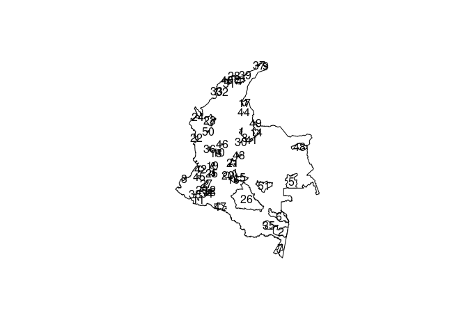
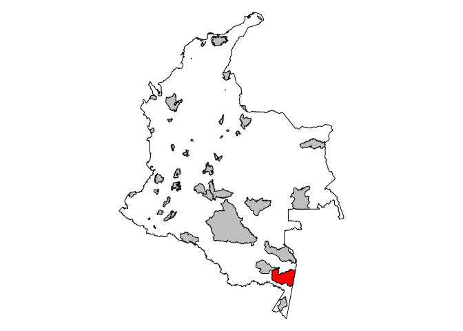
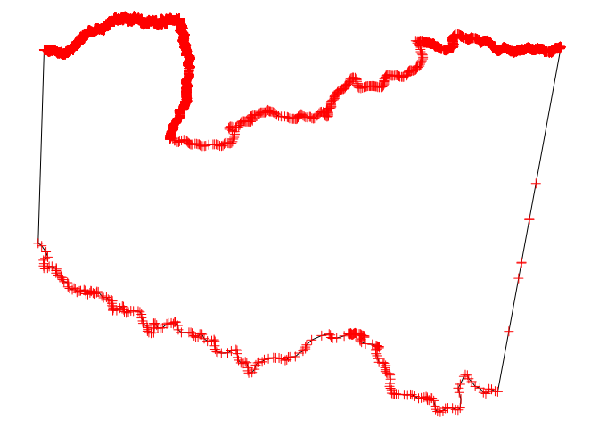
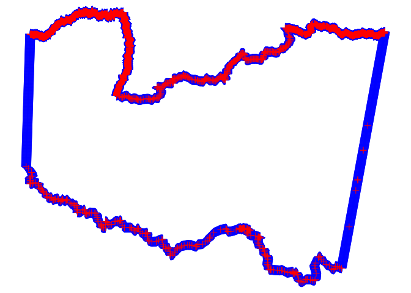
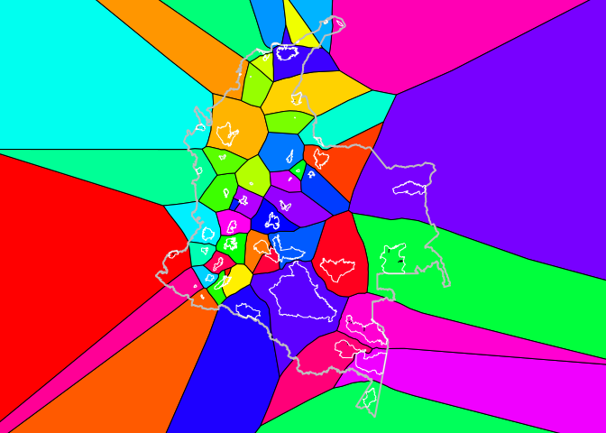
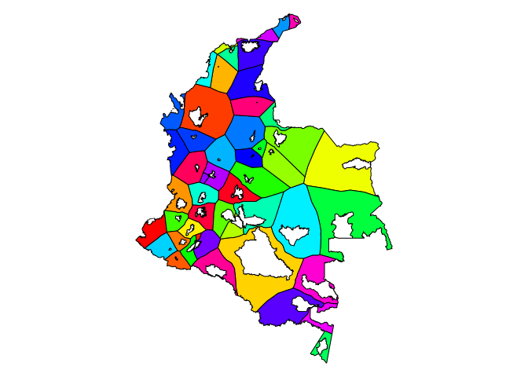
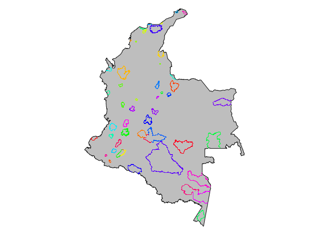
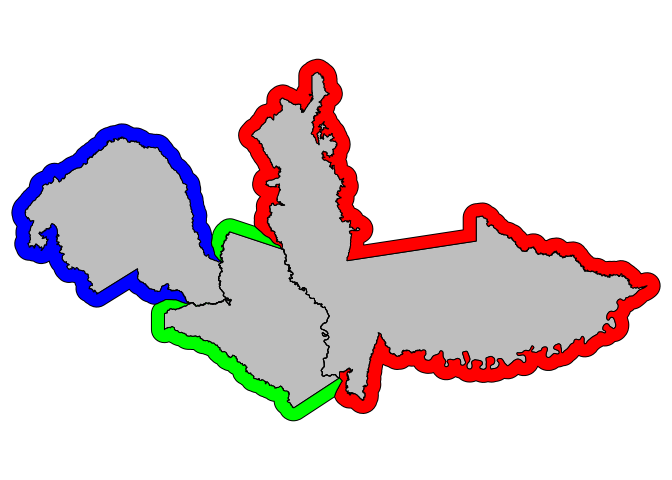

Non overlapping buffers for the Colombian parks
================
Marius Bottin

-   [1 Objectives](#objectives)
-   [2 Requirements](#requirements)
-   [3 Example for creating the
    database](#example-for-creating-the-database)
    -   [3.1 The park table](#the-park-table)
    -   [3.2 Colombian continental territory
        table](#colombian-continental-territory-table)
    -   [3.3 Connecting to the database from
        R](#connecting-to-the-database-from-r)
    -   [3.4 Cleaning the raw tables](#cleaning-the-raw-tables)
    -   [3.5 Representing the spatial
        tables](#representing-the-spatial-tables)
-   [4 Creating the “influence zones”](#creating-the-influence-zones)
    -   [4.1 Calculating the distances between
        parks](#calculating-the-distances-between-parks)
    -   [4.2 Creating the park border
        table](#creating-the-park-border-table)
    -   [4.3 Extracting points on the
        borders](#extracting-points-on-the-borders)
    -   [4.4 Applying Voronoi on the extracted
        points](#applying-voronoi-on-the-extracted-points)
    -   [4.5 Collecting all the voronoi polygons corresponding to each
        park](#collecting-all-the-voronoi-polygons-corresponding-to-each-park)
    -   [4.6 Representing the influence
        zones](#representing-the-influence-zones)
-   [5 Final buffers](#final-buffers)
    -   [5.1 Cutting the Voronoi
        polygons](#cutting-the-voronoi-polygons)
    -   [5.2 Representing the final influence
        table](#representing-the-final-influence-table)
    -   [5.3 Creating non overlapping
        buffers](#creating-non-overlapping-buffers)
-   [6 Conclusion](#conclusion)

# 1 Objectives

In order to compare deforestation in the Colombian parks and their
buffers, Kristian Rubiano and Nicola Clerici asked me whether it would
be possible to find a way to create non-overlapping buffers. The main
principle is that no area should be accounted for more than one time in
the analyses. Since some of the parks share borders, we need to make
sure that the buffers do not overlap, and that they do not overlap the
parks neither.

The real difficulty here is to find a method which cut the buffers and
attribute the different parts to the closest park.

We have tried different methods, but we finally chose to use the concept
of Voronoi polygons out of input polygons, in order to find *influence
zone* of the parks in the continental Colombia.

# 2 Requirements

In order to reproduce this example, you will need:

1.  A postgreSQL database called “park” with postgis extension installed
    and authorized access for your user
2.  a table called park in the public schema containing the fields:
    -   *gid* integer primary key ids of the parks (in my case serial)
    -   *name* the name of the parks
    -   *the_geom* a spatial polygon field, consisting of polygons, in a
        spatial reference system in meters facilitating the creation of
        buffers with understandable values
3.  a table containing at least one spatial polygon representing the
    limit of the zone where you’ll be working (in our case it the
    spatial polygon of continental Colombian territory). Note that the
    table needs to have the same spatial reference system than the
    polygons of the park table.
4.  In order to let R communicate with the database and make the
    figures: R, with packages *RPostgres*, *rpostgis*, *sp* and *rgdal*
    installed

# 3 Example for creating the database

Your example might be different, but in order to show you how to create
the database, I will share the following code:

*As a user which has sufficient rights for creating roles and databases
(might be the* postgres *user connected in the postgres database*):

``` sql
CREATE ROLE park_user WITH LOGIN PASSWORD '*****'; -- replace park_user by you username and ***** by your password
CREATE DATABASE park OWNER park_user; -- again replace park_user as your user
```

Then you connect, as a superuser again, to the park database, in order
to insert the extension postgis in your database:

``` sql
CREATE EXTENSION postgis;
```

Now you connect to the database as the user “park_user”, or the user
that you set as owner of the database (the user do not need to be the
owner of the database, but need sufficient rights to apply the
operations). If you do not know about rights and permission in the
PostgreSQL database, a good start may be:
<https://www.postgresql.org/docs/9.0/sql-grant.html>

**Note**: I will use the
[pgpass](https://www.postgresql.org/docs/9.3/libpq-pgpass.html) method,
which consists in keeping the password in a file on my computer, which
allows me not to put any password in this file. If you do not use it,
you will need to explicitly give your password in order to connect to
the database!

## 3.1 The park table

We used the shapefile of the Colombian parks. Further information may be
found at
<http://181.225.72.78/Portal-SIAC-web/faces/Dashboard/Biodiversidad2/areas_protegidas/respuestaEcoRepresentativo.xhtml>.

One of the simplest possibility for integrating spatial objects in a
postgis database is to use the *shp2pgsql* software.

In my computer, operated through Debian Linux, it may be done by sending
the following command line:

``` sql
shp2pgsql -s 3116 -g the_geom ../unsharedData/nonOverlapBuffers/SPNN_SEL.shp park_raw |  psql -d park -U park_user
```

**Note**: *-s 3116* is the option to make the park spatial object to use
the Spatial Reference System: [Magnas Sirgas
(Bogotá)](https://spatialreference.org/ref/epsg/magna-sirgas-colombia-bogota-zone/).
You might want to use another reference system, but please know that a
system which uses meters as a unit would simplify some operations

Now that the database is set, we initiate the connection from R

## 3.2 Colombian continental territory table

We repeat the same operation for the table containing the polygon of the
Colombian continental territory.

``` sql
shp2pgsql -s 3116 -g the_geom ../unsharedData/nonOverlapBuffers/COL_LIMITS.shp col_raw | psql -d park -U park_user
```

## 3.3 Connecting to the database from R

Now that the database is created and the first tables are inserted, we
can connect to the database from R:

``` r
stopifnot(require(RPostgres),require(sp),require(rgdal),require(rpostgis),require(DBI))
```

    ## Loading required package: RPostgres

    ## Loading required package: sp

    ## Loading required package: rgdal

    ## Please note that rgdal will be retired by the end of 2023,
    ## plan transition to sf/stars/terra functions using GDAL and PROJ
    ## at your earliest convenience.
    ## 
    ## rgdal: version: 1.5-27, (SVN revision 1148)
    ## Geospatial Data Abstraction Library extensions to R successfully loaded
    ## Loaded GDAL runtime: GDAL 3.2.2, released 2021/03/05
    ## Path to GDAL shared files: /usr/share/gdal
    ## GDAL binary built with GEOS: TRUE 
    ## Loaded PROJ runtime: Rel. 7.2.1, January 1st, 2021, [PJ_VERSION: 721]
    ## Path to PROJ shared files: /home/marius/.local/share/proj:/usr/share/proj
    ## PROJ CDN enabled: FALSE
    ## Linking to sp version:1.4-5
    ## To mute warnings of possible GDAL/OSR exportToProj4() degradation,
    ## use options("rgdal_show_exportToProj4_warnings"="none") before loading sp or rgdal.

    ## Loading required package: rpostgis

    ## Loading required package: RPostgreSQL

    ## Loading required package: DBI

``` r
db_park <- dbConnect(Postgres(), user = "park_user",dbname = "park")
```

<!-- Cleaning the database in order to apply the treatment from scratch:
-->

## 3.4 Cleaning the raw tables

In order to have clean tables with only the useful data, and to speed up
the processing, we create the following table (this is not a mandatory
operation and you may work directly with the tables you imported in the
previous operations, but then you will need to change the field names).

**Creating the park table**:

``` sql
CREATE TABLE park
   (
      gid integer PRIMARY KEY,
      name text UNIQUE
   );
```

**Adding the geometry column**

``` sql
SELECT AddGeometryColumn('public','park','the_geom',3116,'MULTIPOLYGON',2);
```

| addgeometrycolumn                                       |
|:--------------------------------------------------------|
| public.park.the_geom SRID:3116 TYPE:MULTIPOLYGON DIMS:2 |

1 records

Note that the polygon of the parks are complex and sometimes in
different parts, that’s why we use a “MULTIPOLYGON” geometry.

**Inserting the data into the park table**

``` sql
INSERT INTO park
   (SELECT gid,nombre,the_geom FROM park_raw);
```

**Creating the colombia table**

``` sql
CREATE TABLE colombia
   (
      gid integer PRIMARY KEY,
      name text UNIQUE
   );
```

**Adding a spatial column**

``` sql
SELECT AddGeometryColumn('public','colombia','the_geom',3116,'POLYGON',2);
```

| addgeometrycolumn                                      |
|:-------------------------------------------------------|
| public.colombia.the_geom SRID:3116 TYPE:POLYGON DIMS:2 |

1 records

**Inserting the data in the colombia table**:

``` sql
INSERT INTO colombia
   (SELECT 1, 'Colombia',(ST_Dump(the_geom)).geom AS the_geom FROM col_raw);
```

Note: we use the ST_Dump function because the *shp2pgsql* software
created a “MULTIPOLYGON” geometry while a simple polygon was sufficient
to store the continental territory of Colombia

**Creating spatial indexes to handle more efficiently the spatial
geometries**

``` sql
CREATE INDEX park_the_geom_gist ON park USING GIST(the_geom);
```

``` sql
CREATE INDEX col_the_geom_gist ON colombia USING GIST(the_geom);
```

## 3.5 Representing the spatial tables

``` r
colombia <- pgGetGeom(db_park, name = "colombia", geom = "the_geom")
```

    ## Warning in showSRID(uprojargs, format = "PROJ", multiline = "NO", prefer_proj
    ## = prefer_proj): Discarded datum Unknown based on GRS80 ellipsoid in Proj4
    ## definition

    ## Warning in showSRID(uprojargs, format = "PROJ", multiline = "NO", prefer_proj
    ## = prefer_proj): Discarded datum Unknown based on GRS80 ellipsoid in Proj4
    ## definition

    ## Returning Polygon types in SpatialPolygons*-class.

    ## Warning in dbVersion(conn): NAs introduced by coercion

``` r
park <- pgGetGeom(db_park, name = "park", geom = "the_geom")
```

    ## Returning MultiPolygon types in SpatialPolygons*-class.

    ## Warning in dbVersion(conn): NAs introduced by coercion

``` r
ct_park <- pgGetGeom(db_park, query = "SELECT gid,name, ST_centroid(the_geom) geom FROM park")
```

    ## Returning Point types in SpatialPoints*-class.

    ## Warning in dbVersion(conn): NAs introduced by coercion

``` r
plot(colombia)
plot(park,add = T)
text(ct_park,as.character(ct_park@data$gid))
```

<!-- -->

# 4 Creating the “influence zones”

The idea here is to create “influence zones” in Colombia allowing, for
each park to delimitate the territory in which the park is the closest
one.

In order to create the influence zones, we will use the Voronoi process
(or Thiessen polygons). The problem is that the Voronoi process exists
only for points, and the parks are polygons.

So what we will do is:

1.  extract the borders of the parks
2.  extract points on the border of the parks
3.  create the Voronoi polygons for all of the extracted points
4.  join all the polygons corresponding to one park

## 4.1 Calculating the distances between parks

In order to see which parks need special attention because they are very
close to another one, we check which parks have another park at less
than 1 km.

First we add a boolean field to the park table to store this
information.

``` sql
ALTER TABLE park
ADD COLUMN close_park BOOLEAN DEFAULT false;
```

Then we set this field to true when there is another park at less than 1
km.

``` sql
WITH close AS(
   SELECT DISTINCT a.gid
   FROM park a  JOIN park b ON ST_DWithin(a.the_geom,b.the_geom,1000)
)
UPDATE  park
SET close_park=true
WHERE gid IN (SELECT gid FROM close);
```

## 4.2 Creating the park border table

``` sql
CREATE TABLE border_park AS(
   SELECT gid, ST_boundary(the_geom) the_geom
   FROM park
);
```

Now we create the spatial index for the border geometries:

``` sql
CREATE INDEX border_park_the_geom_gist_idx ON border_park USING GIST(the_geom);
```

## 4.3 Extracting points on the borders

Let’s take an example of a park, Rio Pure to show how postgis usually
extract points from a line geometry:

We will represent this park in red on the Colombian territory:

``` r
par(mar = rep(0,4))
plot(colombia)
plot(park, add=T, col="grey")
plot(park[park$name == "Rio Pure",],col = "red",add=T)
```



``` r
pt_extract <- pgGetGeom(db_park,query =
      "SELECT (ST_DumpPoints(the_geom)).*
      FROM border_park
      WHERE gid=2"
                           )
```

    ## Returning Point types in SpatialPoints*-class.

    ## Warning in dbVersion(conn): NAs introduced by coercion

``` r
par(mar=rep(0,4))
plot(park[park$gid == 2,])
plot(pt_extract,add = T,col = "red")
```



The points which are extracted are not regularly distributed and may not
be sufficient for the Voronoi process. Therefore we might need to
“segmentize” the borders first:

``` r
pt_extract2 <- pgGetGeom(db_park,query =
      "SELECT (ST_DumpPoints(ST_segmentize(the_geom,100))).*
      FROM border_park
      WHERE gid=2"
                           )
```

    ## Returning Point types in SpatialPoints*-class.

    ## Warning in dbVersion(conn): NAs introduced by coercion

``` r
par(mar=rep(0,4))
plot(park[park$gid == 2,])
plot(pt_extract2, cex=1.5, add = T, col= "blue")
plot(pt_extract, add = T, col = "red")
```

<!-- -->

Now you can see that the points (in blue when we first segmentize the
borders) are extracted regurlarly (in fact at least every 100 m) on the
border of the park.

For the actual parks, we will use a negative buffer of 2m (in order to
avoid problems in case of shared borders between 2 parks) and segmentize
the border every 20m for parks which are close to another, and
segmentize the border every 200m otherwise.

``` sql
CREATE TABLE extracted_points AS(
   SELECT gid, (ST_DumpPoints(ST_Segmentize(ST_Boundary(ST_buffer(the_geom,-2)),20))).*
   FROM park
   WHERE close_park
   UNION ALL
   SELECT p.gid, (ST_DumpPoints(ST_Segmentize(b.the_geom,200))).*
   FROM park p
   JOIN border_park b ON p.gid=b.gid
   WHERE NOT close_park
)
;
```

``` sql
CREATE INDEX extracted_points_the_geom_gist_idx ON extracted_points USING GIST(geom);
```

**Note**: it creates more than 3.000.000 points, so you might want to
adapt the parameters to your case.

## 4.4 Applying Voronoi on the extracted points

``` sql
CREATE TABLE voronoi_raw AS(
   SELECT (ST_Dump(ST_VoronoiPolygons(ST_Collect(geom)))).geom
   FROM extracted_points
)
```

``` sql
CREATE INDEX voronoi_raw_geom_gist_idx ON voronoi_raw USING GIST(geom);
```

## 4.5 Collecting all the voronoi polygons corresponding to each park

The voronoi process works on a “collection” of points. We need now to
associate each Voronoi Polygon with the park from which the point was
extracted, and concatenate all the polygons corresponding to a park:

``` sql
CREATE TABLE voronoi_park AS(
   SELECT pt.gid,ST_MakeValid(ST_Multi(ST_Union(ST_MakeValid(v.geom)))) the_geom
   FROM voronoi_raw v
   JOIN extracted_points pt ON ST_intersects(v.geom,pt.geom)
   GROUP BY pt.gid
);
```

**Note**: Because the voronoi process work on millions of points here
and that the point configuration may create weird geometries, we need to
use the “ST_MakeValid”, in order to “clean” the geometries.

Even though we used the ST_MakeValid, if some of the polygons are too
thin, they might be interpreted by postgis as lines or points.

So if you still can’t read some of the geometries here it might be the
problem, here is what you need to do:

``` sql
WITH extract_collections AS(
   SELECT gid, (ST_Dump(the_geom)).geom
   FROM voronoi_park
   WHERE GeometryType(the_geom) = 'GEOMETRYCOLLECTION'
), filter_polyg AS(
   SELECT gid, ST_Multi(ST_Union(geom)) the_geom
   FROM extract_collections
   WHERE GeometryType(geom) = 'POLYGON'
   GROUP BY gid
)
UPDATE voronoi_park p
SET the_geom=fg.the_geom
FROM filter_polyg fg
WHERE p.gid=fg.gid;
```

``` sql
CREATE INDEX voronoi_park_the_geom_gist_idx ON voronoi_park USING GIST(the_geom);
```

## 4.6 Representing the influence zones

``` r
influences <- pgGetGeom(db_park, "voronoi_park", geom="the_geom")
```

    ## Returning MultiPolygon types in SpatialPolygons*-class.

    ## Warning in dbVersion(conn): NAs introduced by coercion

``` r
par(mar=rep(0,4))
COL <- rainbow(51)[order(sample(1:51))]
plot(influences, col = COL[influences$gid],xlim = colombia@bbox["x",], ylim = colombia@bbox["y",])
plot(colombia,border = "grey", col = NA, add = T, lwd=2)
plot(park,border = "white", add = T)
```



# 5 Final buffers

## 5.1 Cutting the Voronoi polygons

In order to have practical influence zones for cutting the buffers, we
need the influence zone to exclude the parks and zones outside of
Colombia.

``` sql
CREATE TABLE influence 
(
   gid_park INT PRIMARY KEY REFERENCES park(gid)
);
```

``` sql
SELECT AddGeometryColumn('public','influence','the_geom',3116,'MULTIPOLYGON',2);
```

| addgeometrycolumn                                            |
|:-------------------------------------------------------------|
| public.influence.the_geom SRID:3116 TYPE:MULTIPOLYGON DIMS:2 |

1 records

``` sql
WITH in_colombia AS(
   SELECT v.gid, ST_Multi(ST_intersection(v.the_geom, c.the_geom)) geom
   FROM voronoi_park v,colombia c
), withoutparks AS(
   SELECT p.gid, ST_Multi(ST_Union(ST_difference(ic.geom,p.the_geom)))
   FROM in_colombia ic
   JOIN park p ON ic.gid=p.gid
   GROUP BY p.gid
)
INSERT INTO influence
(SELECT * FROM withoutparks)
;
```

``` sql
CREATE INDEX influence_the_geom_gist_idx ON influence USING GIST(the_geom);
```

## 5.2 Representing the final influence table

``` r
par(mar=rep(0,4))
inf_final <- pgGetGeom(db_park,"influence",geom='the_geom')
```

    ## Returning MultiPolygon types in SpatialPolygons*-class.

    ## Warning in dbVersion(conn): NAs introduced by coercion

``` r
plot(inf_final,col = COL)
```


## Supressing tables

``` r
toSupp <- c("border_park","extracted_points","voronoi_raw","voronoi_park")
lapply(dbListTables(db_park),function(x,y,c)if (x %in% y) dbRemoveTable(c,x) else return(0),c = db_park,y = toSupp)
```

    ## [[1]]
    ## [1] 0
    ## 
    ## [[2]]
    ## [1] 0
    ## 
    ## [[3]]
    ## [1] 0
    ## 
    ## [[4]]
    ## [1] 0
    ## 
    ## [[5]]
    ## [1] 0
    ## 
    ## [[6]]
    ## [1] 0
    ## 
    ## [[7]]
    ## [1] TRUE
    ## 
    ## [[8]]
    ## [1] TRUE
    ## 
    ## [[9]]
    ## [1] TRUE
    ## 
    ## [[10]]
    ## [1] TRUE
    ## 
    ## [[11]]
    ## [1] 0
    ## 
    ## [[12]]
    ## [1] 0

## 5.3 Creating non overlapping buffers

Now the process of creating buffers can simply be done by keeping the
intersection between the influence table and the buffers. (here we use
buffers of 20 km)

``` sql
CREATE TABLE non_ov_buf_5000 AS(
   SELECT p.gid gid_park,ST_Multi(ST_Union(ST_intersection(ST_Buffer(p.the_geom, 5000),i.the_geom))) the_geom
   FROM park p
   JOIN influence i ON p.gid=i.gid_park
   GROUP BY p.gid
);
```

Let’s look at the result:

``` r
par(mar=rep(0,4))
ring_buf_non_ov <- pgGetGeom(db_park, 'non_ov_buf_5000', geom = "the_geom")
```

    ## Returning MultiPolygon types in SpatialPolygons*-class.

    ## Warning in dbVersion(conn): NAs introduced by coercion

``` r
plot(colombia, col = "grey")
plot(ring_buf_non_ov, col = COL, border = NA, add=T)
```



If we take a closer look in a particularly complicated zone, we obtain:

``` r
par(mar=rep(0,4))
plot(park[park$gid %in% c(16,15,20),],col = "grey")
plot(ring_buf_non_ov[ring_buf_non_ov$gid_park %in% c(16,15,20),], col = rainbow(3), add = T)
```



# 6 Conclusion

The method we used, based on Voronoi/Thiessen polygons allowed us to
create buffer zone to the Colombian natural parks, with no overlap
between the buffers of close natural parks. Used in a scientific article
on the comparison of deforestation in the parks and their buffer zones,
it allowed Rubiano *et al* (in press) to ensure that no area was
accounted for more than once in the analyses.
